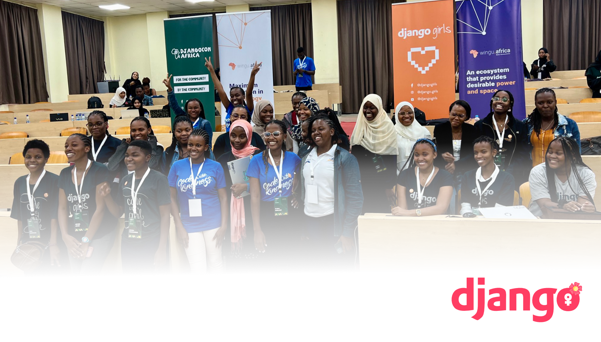

<a href="https://github.com/makindajack/djangogirls">
  

    <picture>
      <source height="150px" media="(prefers-color-scheme: dark)" srcset="./blog/templates/blog/logo/brand-main.svg">
      
    </picture>
  

</a>
 

Jumuiya inayofundisha wanawake jinsi ya kutengeneza programu kwa Django.
 

## Maelezo 📇

Django Girls ni jumuiya inayojitolea kufundisha na kuhamasisha wanawake katika ulimwengu wa teknolojia. Wanajenga ujasiri kwa wanawake kujifunza na kushiriki katika maendeleo ya programu na tovuti kwa kutumia mfumo wa Django wa lugha ya Python. Kupitia warsha na vikao vya kujifunza, Django Girls inawapa wanawake zana na ujuzi wa kujenga tovuti na programu, na kuwasaidia kujitokeza katika sekta ya teknolojia.

Jumuiya hii ina lengo la kuvunja vizuizi vya kijinsia katika teknolojia na kuunda mazingira ya kujifunza yenye usawa. Django Girls inawezesha wanawake kushiriki katika ulimwengu wa programu na kuunda mabadiliko chanya katika sekta ya teknolojia kwa kutoa rasilimali na msaada wa kiufundi. Kupitia jitihada zao, Django Girls inaleta wanawake pamoja kuunda jamii ya kujifunza na kusaidiana, na kuonyesha kwamba kila mwanamke ana uwezo wa kufanikiwa katika teknolojia.

  <picture alt="Credits to Jackson Makinda">
    <source media="(prefers-color-scheme: dark)" srcset="./blog/templates/blog/img/banner/dark.png">
    
  </picture>

\*\*Imemalizika 🎉
Django Girls Zanzibar ilikuwa mafanikio 🚀
Ilikuwa ni furaha kuwa sehemu ya uzoefu wako wa kwanza wa Django.
Hadi tutakapokutana tena.

Vibe, Mikate, na Chokoleti 🤗❤️\*\*

## Kuanza 🎬

Kuanza safari yako na Django Girls, tafadhali rejea kwa [Maelekezo](https://tutorial.djangogirls.org/) ya kina.

## Kuchangia 🤝🏽

Ikiwa unataka kuchangia kwenye mradi wa Django Girls, jisikie huru kuchangia.

### Wachangiaji 👥

Django Girls inawezekana kwa kazi ngumu na ujitoleaji wa wanawake wa Django na mimi (kama kocha).

Asante kwa michango yako yenye thamani! 🧡
